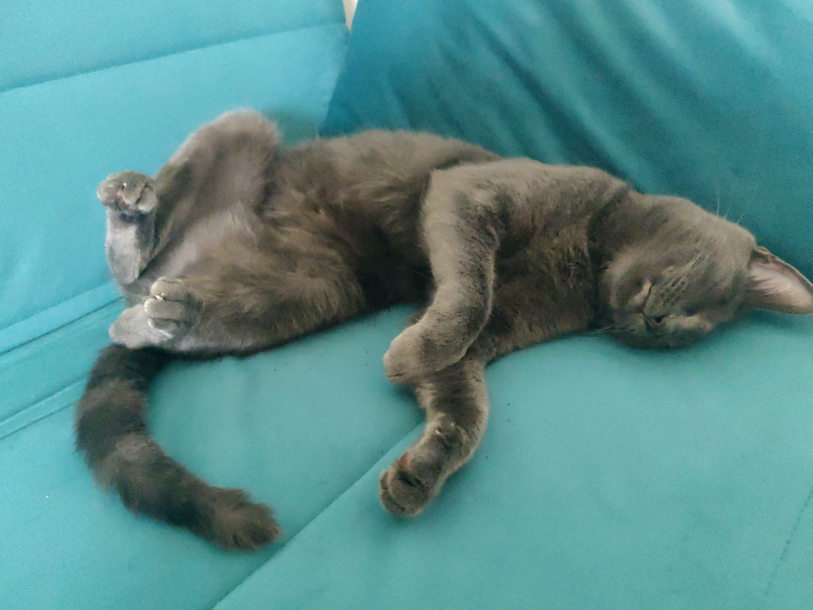

# Une structure de donnée

Voici mon chat, `Grispoil`, 2 ans, en plein effort.



En Rust, un chat ça peut ressembler à ça:
```rust
// A data type definition
struct Cat {
  age: u8,
  pub name: String,
}
```
