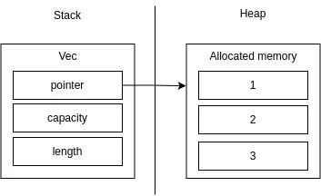

# Rust, stack et heap (2/2)

Si on regarde l'implémentation de Vec:
- [Vec](https://doc.rust-lang.org/std/vec/struct.Vec.html)
- [RawVec](https://doc.rust-lang.org/beta/src/alloc/raw_vec.rs.html#52)
- [String](https://doc.rust-lang.org/std/string/struct.String.html)

<p align="center">
  
</p>

Lorsque l'on veut explicitement stocker une variable sur la heap, on utilise la structure [Box](https://doc.rust-lang.org/std/boxed/struct.Box.html).

```rust
let x = Box::new(42);

println!("{:p} => {:p}", &x, &*x);
```