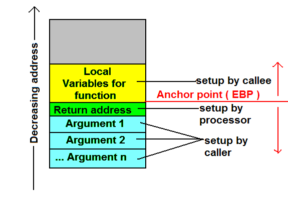

# Fonctionnement de la stack (2/2)

Chaque stackframe va contenir la plupart des variables utilisées par la fonction.

L'allocation mémoire sur la stack est "gratuite", car précalculée à la compilation.

Cela s'oppose à une allocation mémoire sur la Heap, qui va faire appel à l'allocateur mémoire, et potentiellement nécessiter des syscall. A l'instanciation et destruction, les variables sur la Heap sont donc plus coûteuses.

En Rust, le mot clé `let` permet de déclarer des variables sur la stack. Une contrainte de la stack: *la taille doit être connue à l'avance*. C'est également une contrainte du trait `Copy`, coincidence ?